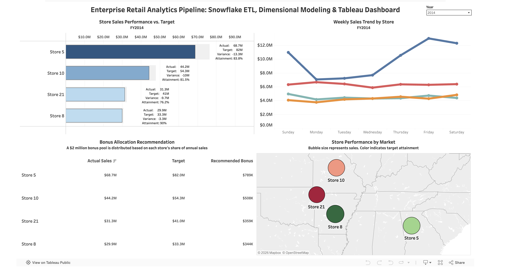

# Enterprise Retail Analytics Pipeline

This project demonstrates an end-to-end retail analytics workflow using Azure Blob Storage, Snowflake, SQL, dimensional modeling, and Tableau. My goal was to build the full analytics pipeline, from loading and transforming raw data to reporting and business insights.

## Dashboard Preview

## Dashboard

**Interactive Tableau Dashboard**

[View the Interactive Tableau Dashboard](https://public.tableau.com/app/profile/ramon.hernandez6474/viz/Dashboard_FinalVersion/Dashboard1)

## Project Overview

I wanted this project to reflect how analytics is used in a real business setting. Starting with raw retail sales data, I stored the files in Azure Blob Storage, transformed the data in Snowflake with SQL, built a dimensional model, and created an interactive Tableau dashboard to answer common business questions.

## Technology Stack

- Azure Blob Storage
- Snowflake
- SQL
- ETL
- Star Schema
- Tableau

## Dashboard Features

- Compare store sales against annual targets
- Explore weekly sales trends
- View store performance by location
- Recommend bonus allocations based on annual sales
- Filter results by year

## Business Questions

- Which stores exceeded their sales targets?
- Which stores fell short?
- How did sales change throughout the week?
- How could a $2 million bonus pool be distributed fairly?
- Which stores performed best by location?

## Project Workflow

Azure Blob Storage → Snowflake → SQL Transformations → Dimensional Model → Analytics Views → Tableau Dashboard

## Lessons Learned

One of the biggest takeaways from this project was seeing how each part of the process builds on the next. Working through Azure Blob Storage, Snowflake, SQL transformations, dimensional modeling, and Tableau reinforced how important a solid data foundation is before building reports and dashboards.

It also gave me hands-on experience troubleshooting data issues, validating calculations, and designing dashboards that present information in a way that's easy to understand and useful for decision-making.

One lesson that stuck with me throughout the project was "measure twice, cut once." In some cases, I measured three or four times before making the cut. Going back to verify table structures, column names, and field mappings before writing SQL usually took less than a minute, but it saved me from spending much longer tracking down avoidable mistakes later.

Another habit I picked up was using a SELECT statement to preview my data before inserting it into a table. Seeing how the columns lined up against the schema before running an INSERT made it much easier to catch mapping issues early and gave me confidence that the data was going where I intended.

## Future Improvements

- Automate data refreshes
- Add forecasting
- Expand the dashboard with additional KPIs
- Make the bonus pool configurable
