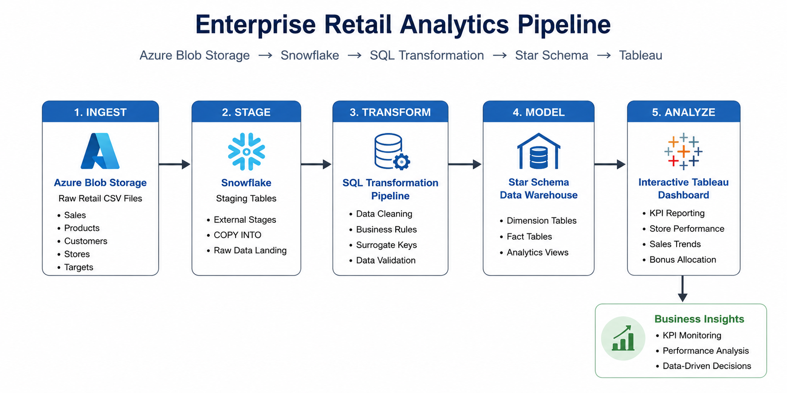
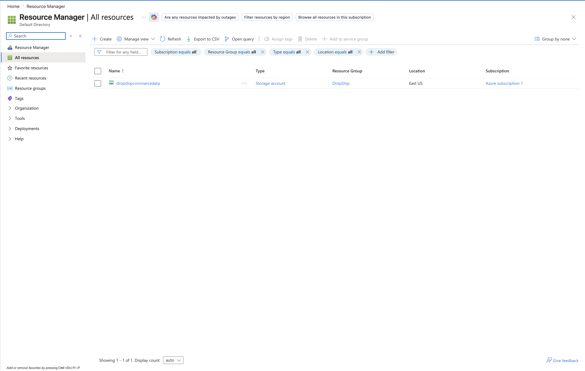
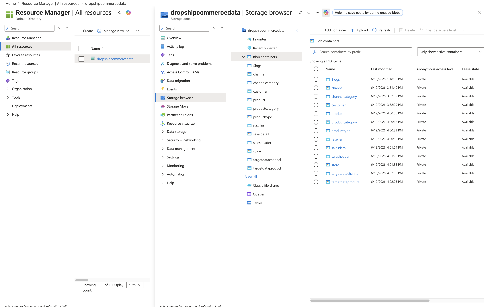
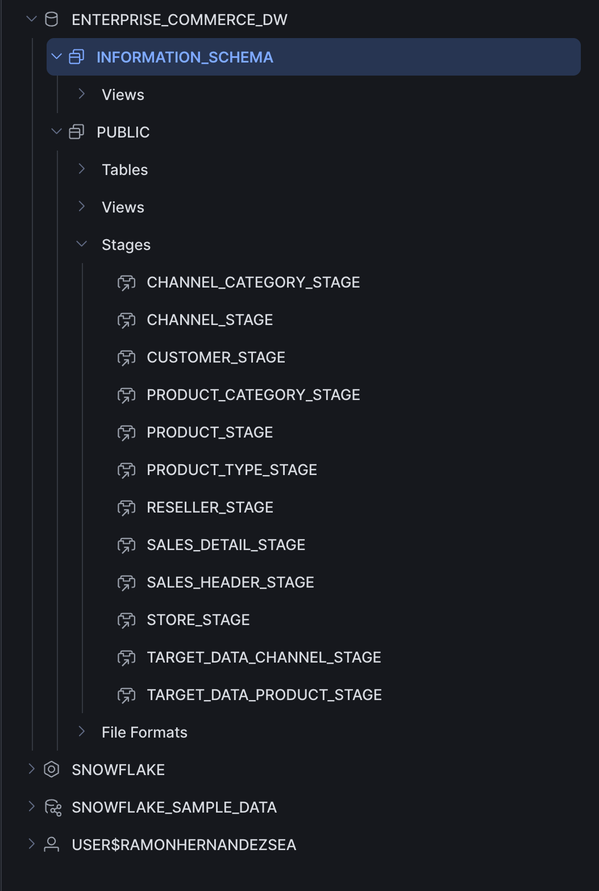
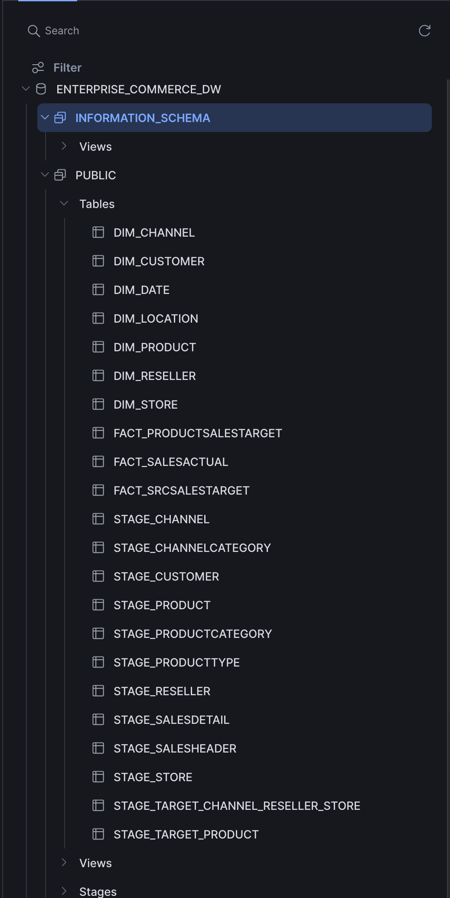
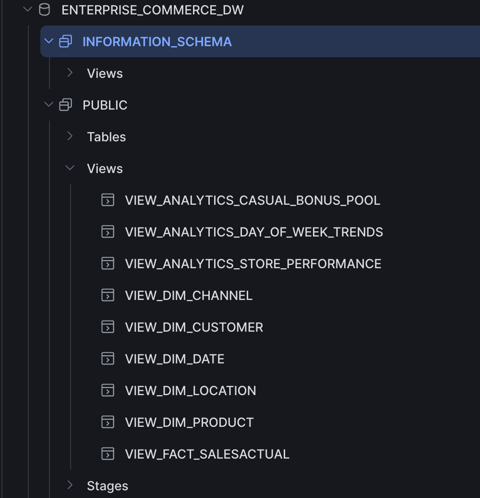
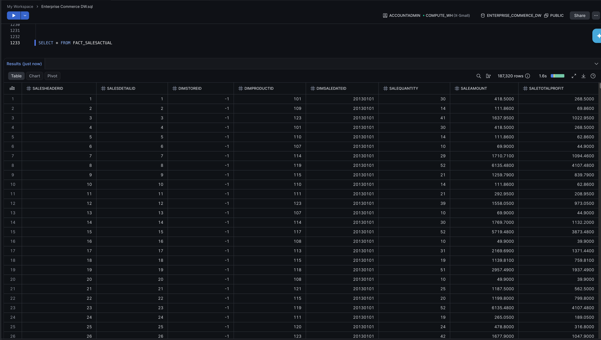
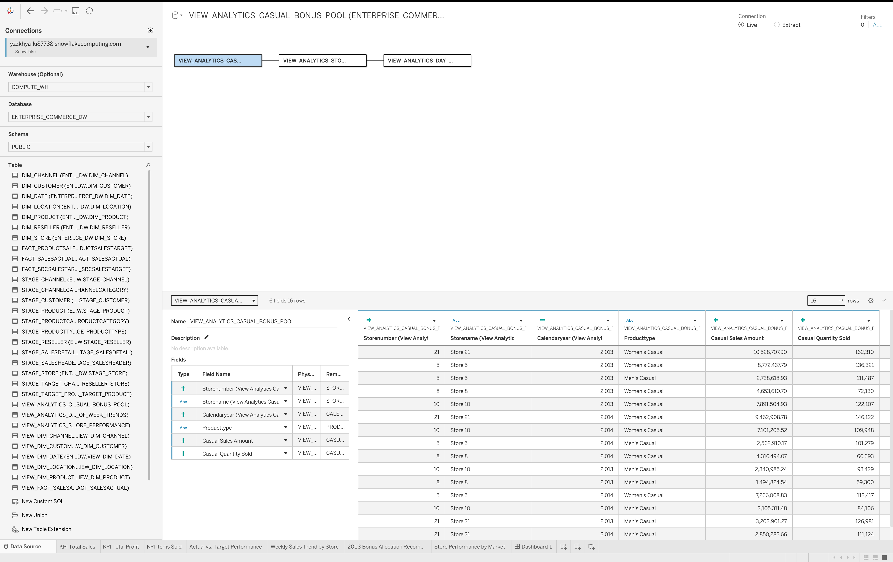

# Enterprise Retail Analytics Pipeline

This project demonstrates an end-to-end retail analytics pipeline using Azure Blob Storage, Snowflake, SQL, dimensional modeling, and Tableau. It follows the complete analytics lifecycle, from loading raw retail data to transforming it into a dimensional data warehouse and building an interactive Tableau dashboard.

**Portfolio:** [ramonhernandesea.github.io](https://ramonhernandesea.github.io)

## Project Workflow

Azure Blob Storage → Snowflake External Stages → SQL Transformations → Star Schema Data Warehouse → Analytics Views → Tableau Dashboard

## Technology Stack

- Azure Blob Storage
- Snowflake
- SQL
- ETL
- Star Schema
- Tableau

## Architecture

The architecture below provides a high-level overview of the complete analytics pipeline. Retail CSV files are stored in Azure Blob Storage, ingested into Snowflake through external stages, transformed using SQL into a dimensional data warehouse, and ultimately visualized in Tableau for business reporting.

## Project Walkthrough

The sections below walk through how the data moves from raw CSV files to the final Tableau dashboard.

### 1. Azure Storage Account

I used Azure Storage as the starting point for the project. It served as the cloud storage location for the raw retail CSV files before they were loaded into Snowflake.

### 2. Azure Blob Containers

Each dataset was organized into its own blob container. Keeping the files separated made it easier to manage the data and load it into Snowflake.

### 3. Snowflake External Stages

I created external stages in Snowflake to connect directly to the Azure Blob containers. This allowed the source files to be loaded into the warehouse without moving them manually.

### 4. Snowflake Database Objects

Once the data was loaded, I built the database objects needed for the warehouse, including staging tables, dimension tables, fact tables, and supporting objects.

### 5. Analytics Views

To make reporting easier, I created SQL views that combined the warehouse data into business-friendly datasets for Tableau.

### 6. Fact Table Validation

Before building the dashboard, I verified that the data was loading correctly by reviewing the fact tables and confirming the transformations produced the expected results.

### 7. Tableau Data Source

The Tableau workbook connects directly to the Snowflake views, allowing the dashboard to use curated datasets instead of querying the warehouse tables directly.

## Dashboard Preview

The completed Tableau dashboard provides an interactive view of store performance, weekly sales trends, and bonus allocation recommendations.

## Dashboard

**Interactive Tableau Dashboard**

[View the Interactive Tableau Dashboard](https://public.tableau.com/app/profile/ramon.hernandez6474/viz/Dashboard_FinalVersion/Dashboard1)

## Project Overview

I wanted this project to reflect how analytics is used in a real business setting. Starting with raw retail sales data, I stored the files in Azure Blob Storage, transformed the data in Snowflake with SQL, built a dimensional model, and created an interactive Tableau dashboard to answer common business questions.

## Dashboard Features

- Compare store sales against annual targets
- Explore weekly sales trends
- View store performance by location
- Recommend bonus allocations based on annual sales
- Filter results by year

## Business Questions

- Which stores exceeded their sales targets?
- Which stores fell short?
- How did sales change throughout the week?
- How could a $2 million bonus pool be distributed fairly?
- Which stores performed best by location?

## Project Workflow

Azure Blob Storage → Snowflake → SQL Transformations → Dimensional Model → Analytics Views → Tableau Dashboard

## Lessons Learned

One of the biggest takeaways from this project was seeing how each part of the process builds on the next. Working through Azure Blob Storage, Snowflake, SQL transformations, dimensional modeling, and Tableau reinforced how important a solid data foundation is before building reports and dashboards.

It also gave me hands-on experience troubleshooting data issues, validating calculations, and designing dashboards that present information in a way that's easy to understand and useful for decision-making.

One lesson that stuck with me throughout the project was "measure twice, cut once." In some cases, I measured three or four times before making the cut. Going back to verify table structures, column names, and field mappings before writing SQL usually took less than a minute, but it saved me from spending much longer tracking down avoidable mistakes later.

Another habit I picked up was using a SELECT statement to preview my data before inserting it into a table. Seeing how the columns lined up against the schema before running an INSERT made it much easier to catch mapping issues early and gave me confidence that the data was going where I intended.

## Future Improvements

- Automate data updates using scheduled Snowflake tasks.
- Expand the dashboard with additional KPIs and executive-level metrics.
- Incorporate sales forecasting to support planning and trend analysis.
- Parameterize the bonus allocation logic so business users can adjust assumptions without modifying SQL.
